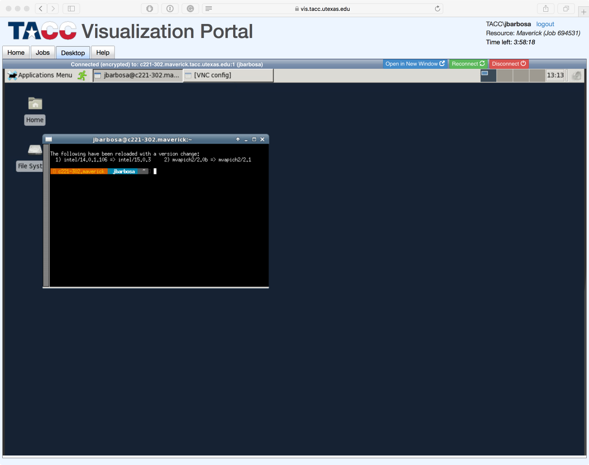

### The TACC Visualization Portal

The TACC Visualization Portal is available [here](https://vis.tacc.utexas.edu). It provides a very simple mechanism to run interactive sessions on stampede2. It presents two choices: to create a VNC desktop (essentially wrapping the above in a much simplified manner, though at cost of some flexibility), and the ability to run RStudio server and iPython Notebook sessions. Please see the [TACC Visualization page](TACC Visualization) for more information.

Pulldowns on this page enable a user choose either to create a stampede2 VNC desktop or an RStudio Server, or an iPython Notebook session. When VNC is selected, the user is presented with pulldowns for setting the various parameters of a VNC session, including the wayness, number of nodes, and desktop dimensions. The portal will then submit a VNC job to the stampede2 vis queue. When the job starts, a VNC viewer will be established in in the portal; alternatively, the Jobs tab will present the a URL and port number that the can be used to connect an external VNC viewer. Note that the portal provides access to only some of the options available through the qsub interface, and the previous method of creating a VNC session through the qsub interface will be necessary in some cases.

The TACC Visualization Portal jobs page also shows the current usage of stampede2; it is a very easy mechanism to find the status of jobs. All jobs submitted to stampede2 - either via qsub or via the Portal, running or in various wait queues, will appear in the status information shown.

### Using the TACC Visualization Portal

#### Login

Access https://vis.tacc.utexas.edu and enter your TACC user name or choose XSEDE to use your XSEDE account.

#### Submiting a Remote Desktop Session

Once you have successfully logged in, you can submit a job to stampede2 using the following form:

| Field                    | Effect     |
|----------------------------|------------|
| Project             | Your project/allocation name |
| Session type                   | Remote Desktop (VNC) : RStudio : iPyhton notebook` |
| Queue                  | stampede2 submission queue |
| Desktop Resolution         | Pixel resolution of your remote desktop |
| Number of Nodes         | Number of required nodes |
| Wayness  | Number of MPI processes per node |
| Set password  | Set the VNC Session password |

If you have not set your VNC session password (or forgot) you will need to set it before submitting the job. When you click start the job is going to be submitted to the queue system.

#### Login in to the VNC server
Once the compute(vis) nodes start running your job submission, the following interface appears to introduce the your VNC password.

#### Woking with the remote desktop
And you will be shown your remote desktop environment:

Previous: [Visualization on stampede2](intro_to_hpc_06.md) | Top: [Course Overview](../../index.md)
